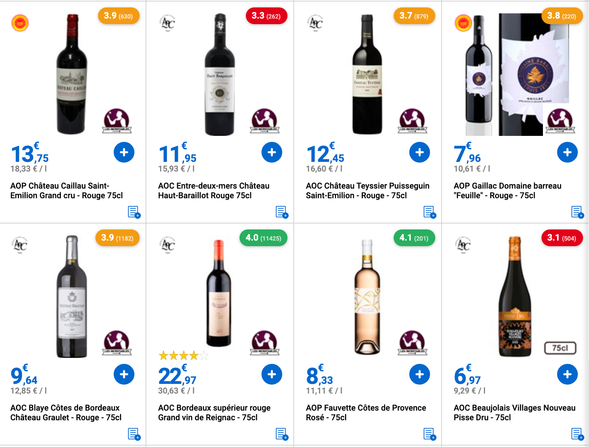

# CaveScore

Browser extension that overlays Vivino ratings directly on wine cards at [leclercdrive.fr](https://www.leclercdrive.fr), with a built-in ranking popup to find the best bottles at a glance.



Color-coded badges appear on each wine card: green (≥ 4.0), yellow (3.5–3.9), red (< 3.5), grey "NR" if no match found.

## Features

- **Inline rating badges** — Vivino score + number of ratings injected directly onto each wine card, progressively as the page loads (infinite scroll supported via MutationObserver)
- **Ranking popup** — click the extension icon to see all wines on the current page sorted by Vivino score, with price and direct links
- **Wine type filter** — filter wines by type (red, white, rosé, sparkling) in the popup
- **Zero config** — no setup needed; the extension reads your active Leclerc Drive store from your existing session
- **Color-coded scores**:
  - 🟢 ≥ 4.0 — green
  - 🟡 3.5–3.9 — yellow
  - 🔴 < 3.5 — red
  - ⚪ no match — grey "NR"

## How it works

1. The content script detects wine cards on any leclercdrive.fr page.
2. For each wine, it sends the name to the background service worker.
3. The service worker queries the Vivino search API (via Algolia) and returns the best match using fuzzy name matching.
4. The rating badge is injected into the card DOM.
5. The popup reads the same cached data to render the ranked list.

## Installation (developer mode)

1. Clone or download this repository.
2. Open Chrome and go to `chrome://extensions`.
3. Enable **Developer mode** (top right toggle).
4. Click **Load unpacked** and select the `src/` folder.
5. Navigate to a wine category page on [leclercdrive.fr](https://www.leclercdrive.fr) — badges appear automatically.

> Requires being logged into leclercdrive.fr for the site to load wine listings.

## Project structure

```
src/
├── manifest.json              # Extension manifest (MV3)
├── content/
│   ├── content.js             # Injected into leclercdrive pages — badge injection
│   └── content.css            # Badge styles
├── popup/
│   ├── popup.html             # Ranking panel UI
│   ├── popup.js               # Ranking + filter logic
│   └── popup.css              # Popup styles
├── background/
│   └── service-worker.js      # Vivino API calls (avoids CORS)
└── icons/
    ├── icon16.png
    ├── icon48.png
    └── icon128.png
```

## Permissions

- `leclercdrive.fr` — to inject content scripts on wine pages
- `vivino.com` + `algolia.net` — to query the Vivino search API
- `storage` — to cache ratings per session
